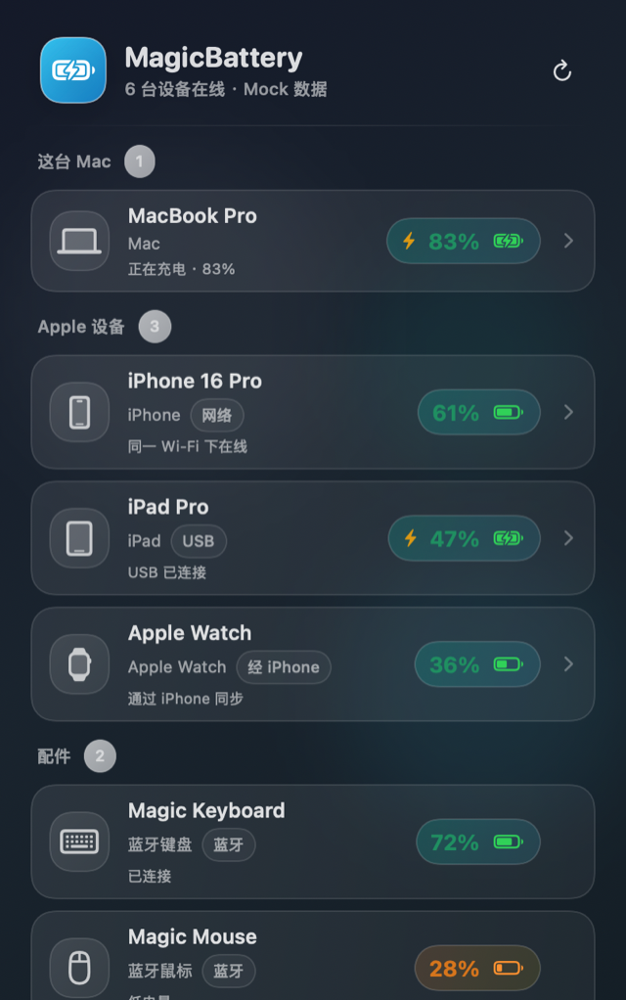
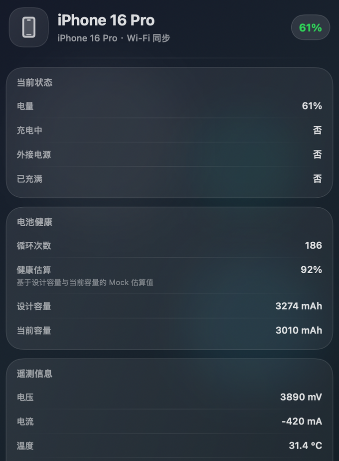
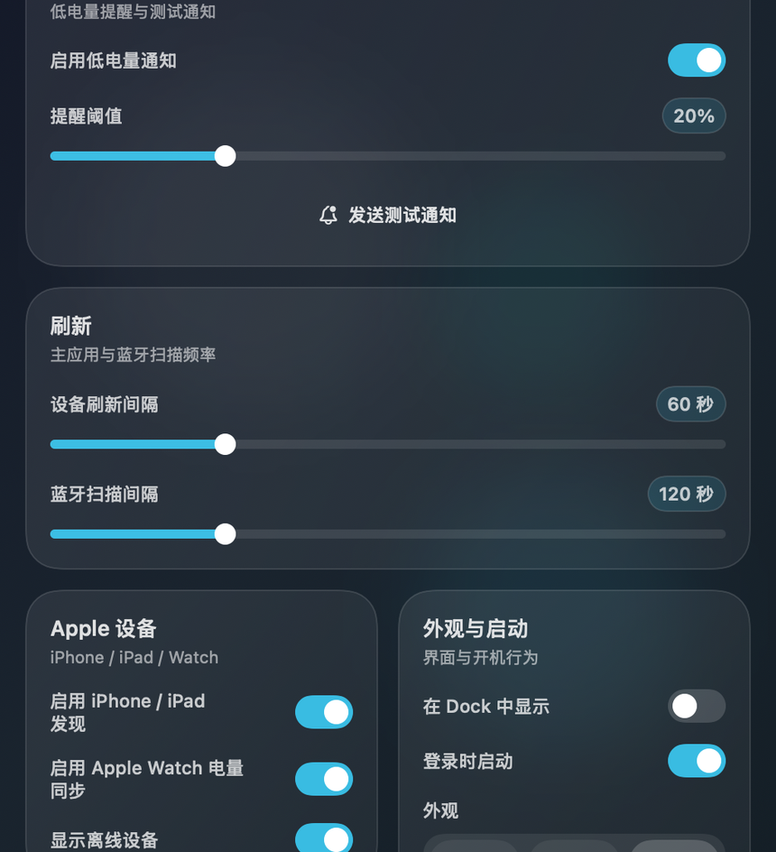
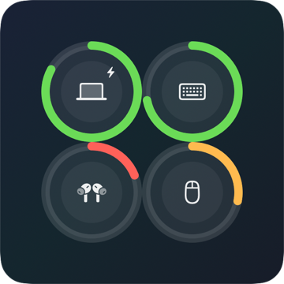
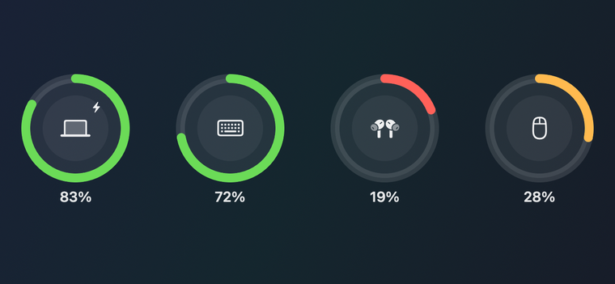
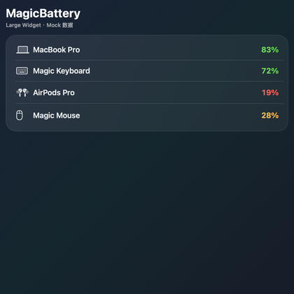

# MagicBattery

一个用于监控 Mac、蓝牙设备以及已信任 iPhone / iPad 电池状态的 macOS 菜单栏应用。

## 当前版本 / Current Release

- 当前版本：`0.0.1`
- 发布状态：首个可运行版本

### 0.0.1 包含的核心能力

- 实时监控 Mac 本机电池状态
- 监控常见蓝牙设备电量（键盘、鼠标、耳机、AirPods 等）
- 菜单栏快速查看电池状态
- 低电量通知提醒
- 多尺寸小组件支持

详细版本说明见：
- [CHANGELOG.md](CHANGELOG.md)
- [RELEASE_NOTES_0.0.1.md](RELEASE_NOTES_0.0.1.md)

## 应用截图

以下截图均使用项目内置 Mock 数据导出，并额外裁剪为更适合 README 展示的尺寸。

### App 界面

<p align="center">
  
  
  
</p>

### Widget 尺寸

<p align="center">
  
  
  
</p>

## 功能特性

### 核心功能
- ✅ 实时监控 Mac 电池状态
- ✅ 监控已连接的蓝牙设备电池（键盘、鼠标、耳机、AirPods 等）
- ✅ 监控已信任的 iPhone / iPad 电池状态（需 USB 连接或同一 Wi-Fi）
- ✅ 菜单栏显示电池图标和电量
- ✅ 低电量自动通知提醒
- ✅ 自定义通知声音
- ✅ 设备列表排序和筛选
- ✅ 设备详情页与最近 24 小时电量历史图表
- ✅ 小组件支持（小、中、大三种尺寸）
- ✅ 中英文双语支持
- ✅ 浅色 / 深色 / 跟随系统外观

### 技术特性
- 🏗️ MVVM 架构设计
- 🔄 Combine 响应式编程
- 🔔 用户通知集成
- 🎨 SwiftUI 原生界面
- 📱 通过 libimobiledevice 支持 iOS 设备

## 项目结构

```
MagicBattery/
├── Models/                 # 数据模型
│   ├── Device.swift       # 设备模型与 DeviceSource 枚举
│   ├── DeviceDetails.swift # 设备详情模型
│   ├── DeviceType.swift   # 设备类型枚举
│   └── DeviceIcon.swift   # 设备图标枚举（SF Symbols 映射）
├── Services/              # 服务层
│   ├── DeviceManager.swift           # 设备管理协议
│   ├── CompositeDeviceManager.swift  # 复合设备管理器（聚合多个数据源）
│   ├── MacBatteryService.swift       # Mac 电池服务（IOKit）
│   ├── BluetoothDeviceService.swift  # 蓝牙设备服务（IOBluetooth）
│   ├── IOSDeviceService.swift        # iOS 设备服务（libimobiledevice）
│   ├── IDeviceToolRunner.swift       # libimobiledevice 工具调用封装
│   ├── IDeviceParser.swift           # ideviceinfo 输出解析器
│   ├── IDeviceDiagnosticsProbe.swift # iOS 设备诊断探针
│   ├── IOSDeviceEventMonitor.swift   # iOS 设备插拔事件监听
│   ├── DeviceDetailsService.swift    # 设备详情查询服务
│   ├── StableDeviceIDStore.swift     # 设备 ID 持久化
│   ├── DeviceTypeOverrideStore.swift # 设备类型手动覆盖
│   ├── NotificationManager.swift     # 通知管理器（含自定义提示音）
│   ├── BatteryHistoryStore.swift     # 电量历史记录存储
│   ├── BluetoothSystemProfilerParser.swift # system_profiler 蓝牙输出解析
│   └── PermissionManager.swift       # 权限管理器
├── ViewModels/            # 视图模型
│   ├── DeviceListViewModel.swift     # 设备列表视图模型
│   └── DeviceDetailsViewModel.swift  # 设备详情视图模型
├── Views/                 # 视图
│   ├── MenuBarManager.swift          # 菜单栏管理器
│   ├── MenuBarPopoverView.swift      # 菜单栏弹出视图
│   ├── DeviceRowView.swift           # 设备行视图
│   ├── DeviceDetailsSheet.swift      # 设备详情弹窗
│   ├── BatteryIconView.swift         # 电池图标组件
│   ├── SettingsView.swift            # 设置视图
│   └── PermissionRequestView.swift   # 权限请求视图
├── Widgets/               # 小组件
│   ├── BatteryWidget.swift           # 电池小组件
│   └── WidgetDataManager.swift       # 小组件数据管理器
├── Utils/
│   └── AppLogger.swift    # 统一日志系统（OSLog）
└── batteryApp.swift       # 应用入口
```

## 系统要求

- macOS 15.6+
- Xcode 26.0+
- Swift 5.9+

## 权限要求

应用需要以下权限才能正常工作：

1. **通知权限**（必需）
   - 用于发送低电量提醒

2. **蓝牙权限**（必需）
   - 用于监控蓝牙设备电量

## 安装

### 从 Release 下载

1. 前往 [Releases](https://github.com/lichao0223/magic-battery/releases) 页面
2. 根据你的 Mac 芯片类型下载对应的 DMG 文件：
   - **Intel Mac (x86_64)**：下载 `MagicBattery-版本号-intel.dmg`
   - **Apple Silicon (M1/M2/M3/M4)**：下载 `MagicBattery-版本号-apple-silicon.dmg`
3. 打开 DMG，将 MagicBattery.app 拖到 Applications 文件夹

### 解除 macOS 安全限制

由于应用未经 Apple 签名，macOS 会阻止打开。以下任一方式均可解决：

**方式一：右键打开（推荐）**

右键点击 MagicBattery.app → 选择"打开" → 在弹窗中点击"打开"。仅首次需要，之后可正常双击启动。

**方式二：系统设置放行**

打开"系统设置 → 隐私与安全性"，底部会显示"MagicBattery 已被阻止"，点击"仍要打开"。

**方式三：终端移除隔离属性**

```bash
xattr -cr /Applications/MagicBattery.app
```

## 构建和运行

### 1. 克隆项目

```bash
git clone <repository-url>
cd battery
```

### 2. 配置签名与 App Group

项目默认使用 `APP_GROUP_IDENTIFIER = group.com.lc.battery` 作为主应用和小组件之间的共享容器标识。仓库不再写死 `DEVELOPMENT_TEAM`，首次在新机器打开时需要你自己选择 Team。

1. 选择项目 -> `Signing & Capabilities`
2. 确认 `Automatically manage signing` 已启用
3. 如 Xcode 未自动选择 Team，手动选择你的开发团队
4. 确认 `App Groups` capability 已启用
5. 默认情况下无需修改源码中的 App Group 字符串

### 3. 配置 Info.plist

项目当前通过 build settings 生成大部分 Info.plist 字段，至少需要以下权限描述：

```xml
<key>NSBluetoothAlwaysUsageDescription</key>
<string>需要访问蓝牙以监控蓝牙设备的电池状态</string>
<key>NSLocalNetworkUsageDescription</key>
<string>需要访问本地网络以发现已配对的 iPhone、iPad 并读取其电量信息</string>
```

> macOS 的通知授权由 `UNUserNotificationCenter` 在运行时请求，不需要额外添加 `NSUserNotificationsUsageDescription`。

### 4. 构建项目

**本地免签名调试运行（推荐）**

```bash
./scripts/run-local.sh run
```

**本地免签名测试**

```bash
./scripts/run-local.sh test
```

**使用 Mock 数据启动 App（用于演示 / 本地对 UI 做快速检查）**

```bash
./scripts/run-local.sh mock
```

**导出 README 用截图（菜单栏弹窗 / 设备详情 / 设置页 / Widget 小中大尺寸）**

```bash
./scripts/run-local.sh screenshots
```

该命令会同时：
- 重新导出 `docs/screenshots/` 下的原始截图
- 同步刷新 README 使用的 `*-readme.png` 缩放图

**Xcode / 已配置 Team 的签名构建**

```bash
xcodebuild -scheme battery -configuration Release -allowProvisioningUpdates
```

或在 Xcode 中直接运行（⌘R）

## 使用说明

### 首次启动

1. 应用会请求必要的权限（通知、蓝牙）
2. 授予权限后，应用会自动开始监控设备
3. 菜单栏会显示电池图标

### 监控 iPhone / iPad 电池

要查看 iPhone 或 iPad 的电池状态，需要完成以下设置：

#### 1. 首次 USB 连接并信任设备

**第一次连接时必须使用 USB 数据线：**

1. 使用 USB 数据线将 iPhone/iPad 连接到 Mac
2. iPhone/iPad 会弹出"要信任此电脑吗？"提示
3. 点击"信任"并输入设备密码
4. 等待几秒钟，MagicBattery 会自动检测到设备并显示电池信息

> **重要提示**：只有完成"信任"操作后，Mac 才能读取 iOS 设备的电池信息。这是 iOS 的安全机制。

#### 2. 后续使用（支持 Wi-Fi 同步）

完成首次信任后，有两种方式继续监控：

**方式一：USB 连接（推荐）**
- 随时插入 USB 数据线即可查看电池状态
- 响应速度最快，最稳定

**方式二：Wi-Fi 同步**
1. 确保 iPhone/iPad 和 Mac 连接到同一个 Wi-Fi 网络
2. 在 Finder 中选择你的设备
3. 勾选"通过 Wi-Fi 与此 iPhone/iPad 同步"
4. 设备会自动出现在 MagicBattery 中（可能需要几秒钟）

> **注意**：Wi-Fi 同步需要设备处于唤醒状态或正在充电。如果设备锁屏时间过长，可能需要重新唤醒设备。

#### 3. 常见问题

**Q: 为什么看不到我的 iPhone？**
- 确认已完成"信任此电脑"操作
- 尝试重新插拔 USB 数据线
- 检查数据线是否支持数据传输（不是仅充电线）
- 重启 MagicBattery 应用

**Q: Wi-Fi 同步不稳定怎么办？**
- 确保设备和 Mac 在同一 Wi-Fi 网络
- 尝试在 Finder 中重新勾选"通过 Wi-Fi 同步"
- 使用 USB 连接更稳定可靠

**Q: 需要安装 iTunes 吗？**
- 不需要，MagicBattery 自带 libimobiledevice 工具
- 无需额外安装任何依赖

### 菜单栏功能

- **点击图标**：显示设备列表弹出窗口
- **图标显示**：显示 Mac 电池电量和充电状态
- **工具提示**：悬停显示详细电池信息

### 设备列表

- 显示所有已连接设备的电池状态（Mac、蓝牙设备、iOS 设备）
- 支持按电量、名称、更新时间、设备类型排序
- 支持筛选（全部、低电量、充电中、按类型）
- 显示低电量设备数量提示
- 点击设备可查看详细信息（型号、序列号、充电状态等）

### 设置选项

- **通知设置**
  - 启用/禁用低电量通知
  - 设置低电量阈值（10%-50%）
  - 选择通知声音
  - 发送测试通知

- **更新设置**
  - 设置更新间隔（30-300秒）
  - 设置蓝牙补充扫描间隔

- **应用设置**
  - 在 Dock 中显示/隐藏
  - 登录时启动
  - 选择外观模式（跟随系统 / 浅色 / 深色）

### 小组件

1. 右键点击桌面 -> 编辑小组件
2. 搜索"MagicBattery"
3. 选择小组件尺寸（小、中、大）
4. 拖放到桌面

如果构建后系统里没有出现 `MagicBattery` 小组件，先删除旧组件实例，再执行 `./scripts/refresh-widget-cache.sh`，然后重新运行主 App。

## 开发说明

### 架构设计

应用采用 MVVM 架构：

- **Model**：定义数据结构（Device, DeviceType, DeviceIcon, DeviceDetails）
- **View**：SwiftUI 视图组件
- **ViewModel**：业务逻辑和状态管理
- **Service**：底层服务（设备监控、通知、权限等）

### 关键组件

#### DeviceManager 协议
定义设备管理的核心接口，支持多种设备管理器实现。CompositeDeviceManager 聚合 Mac、蓝牙、iOS 三个数据源。

#### MacBatteryService
使用 IOKit 框架获取 Mac 电池信息：
- 电池电量百分比
- 充电状态
- 定时更新（60秒）

#### BluetoothDeviceService
使用 IOBluetooth 框架监控蓝牙设备：
- 已连接设备列表
- 通过 HID 属性读取电池电量
- 设备类型智能识别
- 定时更新（30秒）

#### IOSDeviceService
通过 libimobiledevice 工具监控 iOS 设备：
- 支持 USB 和 Wi-Fi 两种连接方式
- 自动发现已信任的 iPhone / iPad
- 读取电池电量、充电状态和设备详情

#### NotificationManager
管理系统通知：
- 低电量提醒
- 通知去重
- 前台显示支持
- 自定义通知声音与试听

#### BatteryHistoryStore
持久化设备电量历史：
- 记录最近采样结果
- 为设备详情页提供最近 24 小时趋势数据
- 与主应用 / 小组件共享一致的数据来源

### 测试

运行单元测试：

```bash
xcodebuild test -scheme battery -destination 'platform=macOS'
```

当前测试覆盖：
- Device 模型创建和验证
- 电池电量范围限制（-1 到 100）
- 设备类型显示名称
- 设备图标映射
- 计算属性（isLowBattery, batteryColor）
- Codable 编解码与向后兼容
- IDeviceTool 枚举与错误描述
- 蓝牙设备去重逻辑
- system_profiler 蓝牙解析与 AirPods 组件信息提取

## 已知问题

1. **部分蓝牙设备电量显示为未知**
   - 并非所有蓝牙设备都通过 HID 属性暴露电池电量
   - 不支持 BLE GATT Battery Service 的设备会显示为"电量未知"

2. **AirPods 左右耳机 / 充电盒独立电量仍未完整落地**
   - 当前已具备 AirPods 相关类型与部分解析能力
   - 但最终展示仍以聚合设备为主，未稳定提供左右耳机与充电盒三路独立电量

## 近期已完成

- [x] 添加设备详情页中的最近 24 小时电量历史记录与图表
- [x] 支持自定义通知声音与测试播放
- [x] 支持浅色 / 深色 / 跟随系统外观
- [x] 刷新 README 使用的 Mock 截图导出流程

## 后续计划

- [ ] 支持 AirPods 左右耳机 / 充电盒独立电量显示
- [ ] 继续补充单元测试、集成测试与 UI 测试覆盖
- [ ] 优化 Widget 刷新与设备趋势分析体验

## 贡献

欢迎提交 Issue 和 Pull Request！

## 第三方依赖与鸣谢

本项目在 [`Vendor/libimobiledevice`](Vendor/libimobiledevice) 中打包了 `libimobiledevice` 生态的预编译工具和动态库，用于发现已配对的 iPhone、iPad 并读取相关设备信息。

- 感谢 `libimobiledevice` 项目及其相关组件
- 当前仓库内已包含对应的二进制文件，位于 [`Vendor/libimobiledevice/bin`](Vendor/libimobiledevice/bin) 和 [`Vendor/libimobiledevice/lib`](Vendor/libimobiledevice/lib)
- 随仓库提供的许可证文本位于 [`Vendor/libimobiledevice/COPYING`](Vendor/libimobiledevice/COPYING)
- 更完整的第三方来源与许可证说明见 [`THIRD_PARTY_NOTICES.md`](THIRD_PARTY_NOTICES.md)
- 上游项目与许可证说明可参考：
  - `libimobiledevice`: https://github.com/libimobiledevice/libimobiledevice
  - `libplist`: https://github.com/libimobiledevice/libplist
  - `libusbmuxd`: https://github.com/libimobiledevice/libusbmuxd

## 许可证

本仓库中的自有源码采用 MIT License，第三方预编译组件遵循各自的上游许可证。详见 [`LICENSE`](LICENSE) 和 [`THIRD_PARTY_NOTICES.md`](THIRD_PARTY_NOTICES.md)。
